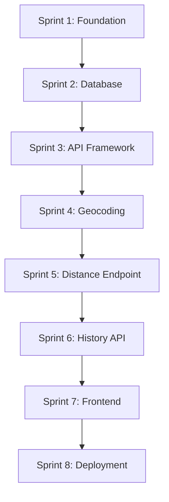

# Sprint Planning Overview

This directory contains detailed sprint planning documentation for the Delivery Distance Tracker project. The project is divided into 8 logical sprints, each building upon the previous work to deliver a complete, production-ready application.

## 📋 Sprint Overview

| Sprint | Name | Objective | Key Deliverables |
|--------|------|-----------|------------------|
| 1 | Foundation | Project setup and development environment | Git workflow, Python env, project structure |
| 2 | Database | PostgreSQL setup and schema implementation | Docker DB, SQLAlchemy models, migrations |
| 3 | API Framework | FastAPI foundation with routing and health checks | App structure, CORS, error handling, health endpoint |
| 4 | Geocoding | Nominatim integration and address validation | Geocoding service, validation, distance calculation |
| 5 | Distance Endpoint | POST /distance implementation with storage | Complete endpoint, request/response models, DB storage |
| 6 | History API | GET /history with pagination and filtering | History endpoint, pagination, search, sorting |
| 7 | Frontend | SvelteKit application with full UI | Complete frontend, API integration, responsive design |
| 8 | Deployment | Docker containerization and production readiness | Docker setup, E2E testing, documentation, deployment |

## 🎯 Sprint Methodology

Each sprint follows a consistent structure:

### Acceptance Criteria
- Clear, measurable requirements that must be met
- Broken down into 5 major categories per sprint
- Each category contains 3-5 specific deliverables

### Test Cases
- 5 comprehensive test cases per sprint
- Must pass before sprint completion
- Include unit tests, integration tests, and validation
- Specific test code examples provided

### Implementation Steps
- Detailed step-by-step implementation guide
- Logical ordering of development tasks
- Clear dependencies between components

### Git Workflow
- Consistent branching strategy across all sprints
- Feature branch naming convention
- Conventional commit message format
- Pull request and merge process

### Quality Gates
- Code quality requirements (formatting, linting)
- Test coverage targets
- Performance benchmarks
- Security validation

## 🧪 Testing Strategy

### Unit Tests
- Individual function and component testing
- Mock external dependencies
- 80%+ code coverage target
- Fast execution for development feedback

### Integration Tests
- API endpoint testing
- Database integration verification
- Service layer interaction testing
- External API integration testing

### End-to-End Tests
- Complete user workflow validation
- Frontend-backend integration
- Real browser automation testing
- Production environment simulation

## 🔧 Development Workflow

### Branch Strategy
```
main (production-ready code)
├── develop (integration branch)
    ├── feature/sprint-01-foundation
    ├── feature/sprint-02-database
    ├── feature/sprint-03-api-framework
    ├── feature/sprint-04-geocoding
    ├── feature/sprint-05-distance-endpoint
    ├── feature/sprint-06-history-api
    ├── feature/sprint-07-frontend
    └── feature/sprint-08-deployment
```

### Commit Convention
- `feat:` - New features
- `fix:` - Bug fixes
- `chore:` - Maintenance tasks
- `docs:` - Documentation updates
- `test:` - Test additions or updates

### Sprint Completion Criteria
1. All acceptance criteria checkboxes completed
2. All 5 test cases pass without errors
3. Code passes quality gates (formatting, linting, coverage)
4. Feature branch ready for merge to develop
5. Documentation updated appropriately

## 🚀 Technology Stack Integration

### Backend
- **FastAPI** - Modern Python web framework
- **PostgreSQL** - Relational database with geospatial support
- **SQLAlchemy** - ORM for database operations
- **Pytest** - Testing framework
- **Docker** - Containerization

### Frontend
- **SvelteKit** - Modern frontend framework
- **TypeScript** - Type-safe JavaScript
- **Vite** - Build tool and development server
- **Jest + Testing Library** - Frontend testing

### DevOps
- **Docker Compose** - Multi-container orchestration
- **Playwright** - End-to-end testing
- **GitHub Actions** - CI/CD pipeline (future enhancement)

## 📖 Getting Started

1. **Read the planning documents** - Start with `project-outline-answered.txt` and `stack-decision.md`
2. **Choose your sprint** - Begin with Sprint 1 or jump to any specific sprint
3. **Follow the acceptance criteria** - Complete each checkbox systematically
4. **Run the test cases** - Ensure all tests pass before moving forward
5. **Commit your work** - Use the specified Git workflow
6. **Document as you go** - Update relevant documentation

## 🔄 Sprint Dependencies



Each sprint builds upon the previous ones, but skilled developers can work on later sprints by implementing earlier components as needed.

## 📋 Quality Assurance

### Code Quality
- **Black** - Python code formatting
- **Flake8** - Python linting
- **Prettier** - Frontend code formatting
- **ESLint** - JavaScript/TypeScript linting

### Security
- Input validation and sanitization
- SQL injection prevention
- XSS protection
- Secure environment variable management
- Container security best practices

### Performance
- Database query optimization
- Efficient API response times
- Frontend bundle size optimization
- Docker image size optimization

## 🎯 Success Metrics

### Technical Metrics
- All test suites pass (unit, integration, E2E)
- Code coverage >= 80%
- API response times < 2 seconds
- Application startup time < 30 seconds

### Functional Metrics
- Distance calculation accuracy
- Geocoding success rate
- Database query performance
- User interface responsiveness

## 🤝 Contributing

When working on sprints:

1. **Follow the sprint order** for best results
2. **Complete all acceptance criteria** before moving forward
3. **Write tests first** when possible (TDD approach)
4. **Document your decisions** and any deviations
5. **Keep commits focused** and use conventional format
6. **Test thoroughly** before marking items complete

## 📞 Support

Each sprint document contains:
- **Detailed implementation steps**
- **Complete test cases with examples**
- **Troubleshooting guidance**
- **Clear exit criteria**

If you encounter issues:
1. Review the specific sprint documentation
2. Check the test cases for validation
3. Verify previous sprint completion
4. Review the stack decision and project outline documents

---

**Happy coding! 🚀**